# 🧠 Mini LMS – AI Assisted Learning Management System

A modern Learning Management System (LMS) built during a product development hackathon, focusing on rapid development using AI-assisted workflows and structured prompting.

---

## 🚀 Project Context

- 🏆 Built during **Dizrupt Hackathon (Jan 2026)**
- 🤖 Developed using **AI-assisted development (prompt-driven approach)**
- 👥 Team of 3 contributors
- 🏢 Licensed under **Ideassion Technology Solutions**

This project demonstrates how AI can accelerate full-stack product development from UI design to functional workflows.

---

## 🎯 Features

### 👤 Role-Based System
- Institution Admin
- Instructor
- Learner

---

### ⚙️ Admin Features
- Manage courses, instructors, batches
- Track enrollments and platform activity
- Dashboard analytics

---

### 👨‍🏫 Instructor Features
- Manage assigned batches
- Upload materials
- Track learner progress

---

### 🎓 Learner Features
- Discover courses
- Enroll in batches
- Track learning progress
- Access course content

---

## 🛠 Tech Stack

- React
- JavaScript / TypeScript
- Chart Libraries
- AI-assisted development (prompt engineering)

---

## 🤖 AI Development Approach

- Built using structured prompting
- Rapid UI generation using AI
- Iterative refinement of components
- Focus on speed + usability + modular design

---

## 📱 Screenshots

### 🏠 Landing

  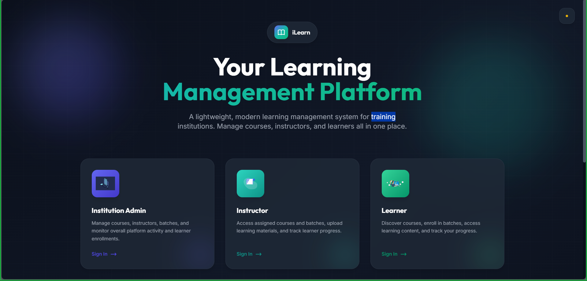
  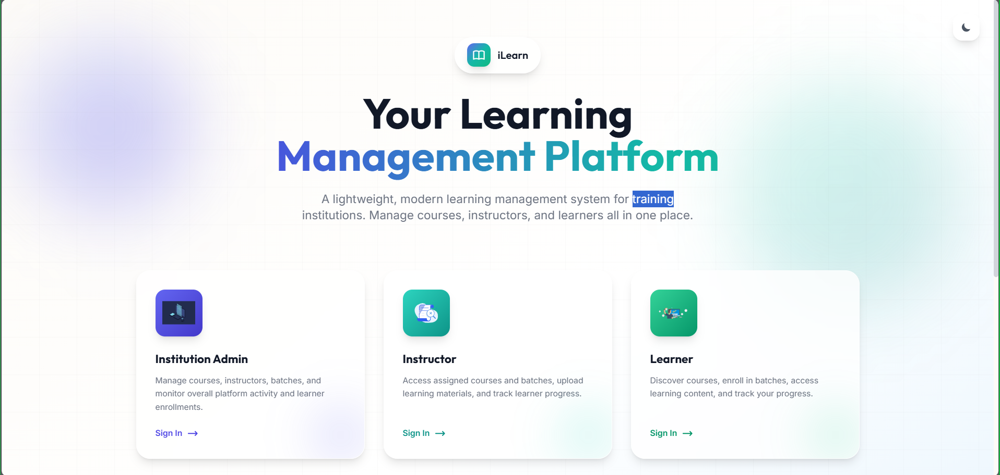

---

### 🔐 Authentication

  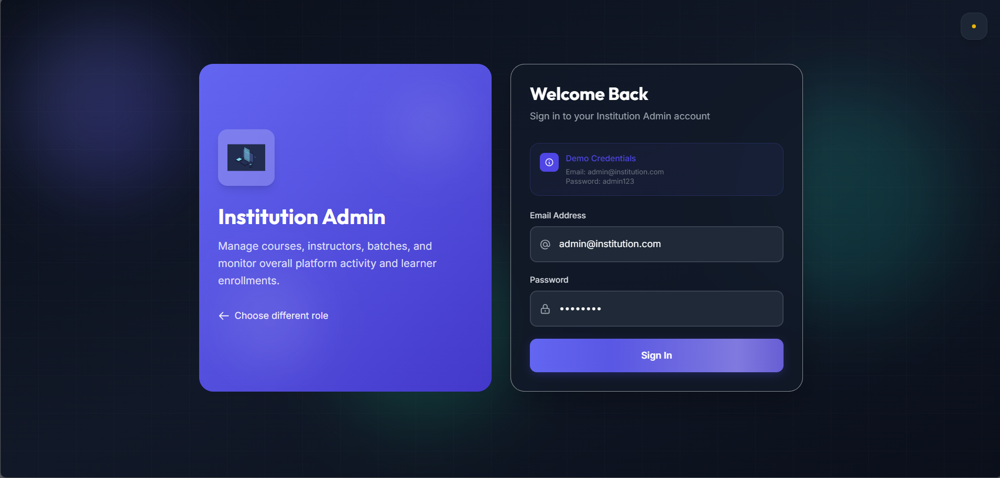
  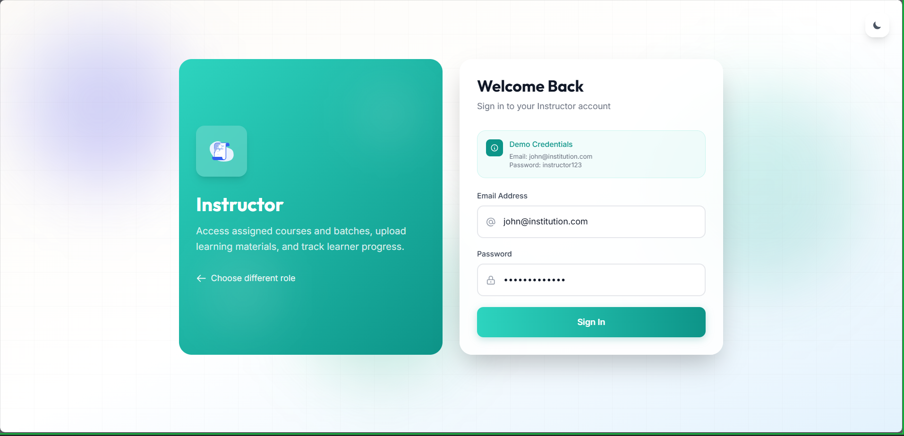
  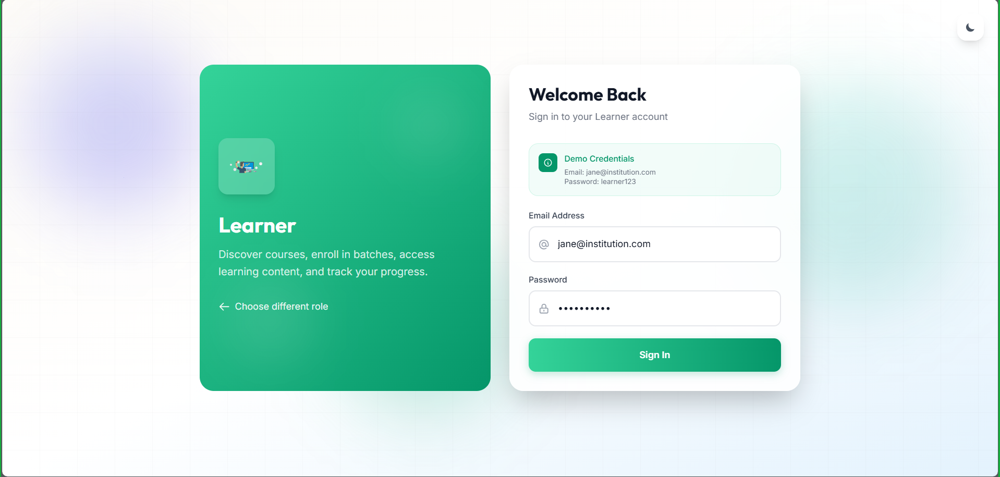

---

### ⚙️ Admin Panel

  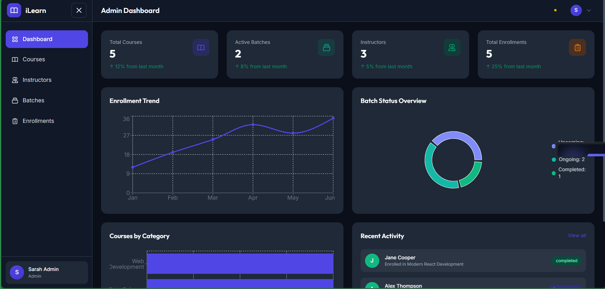
  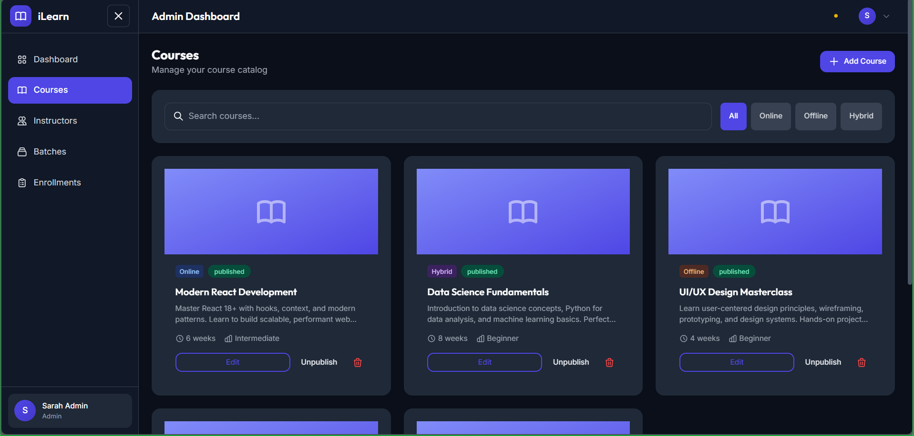
  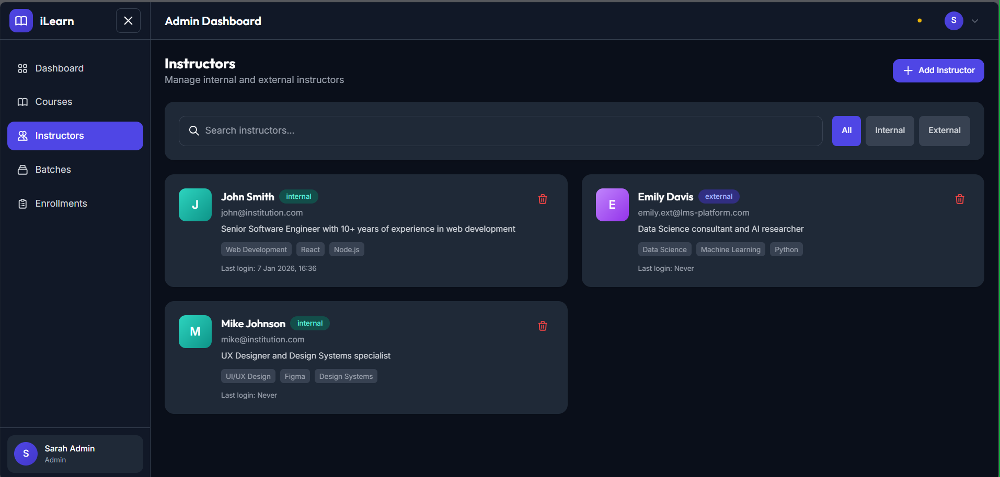

  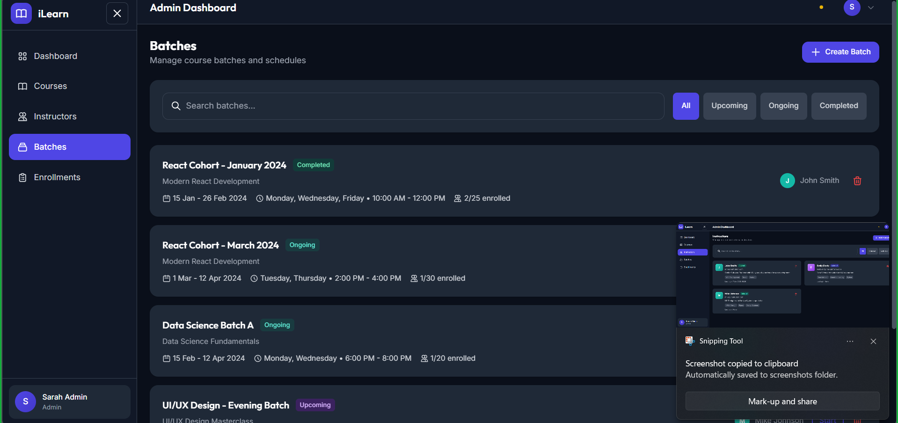
  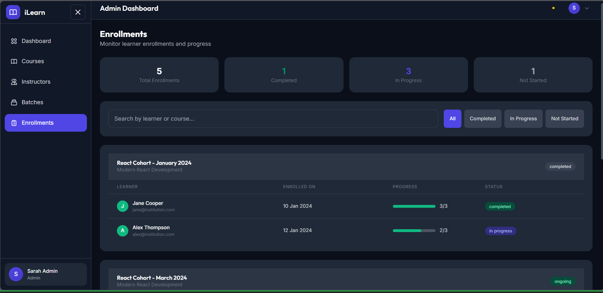

---

### 👨‍🏫 Instructor Panel

  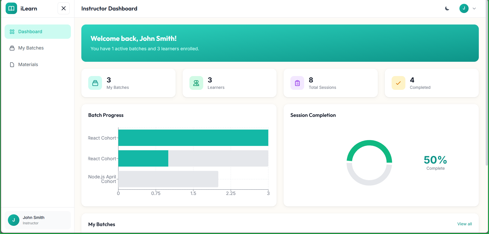
  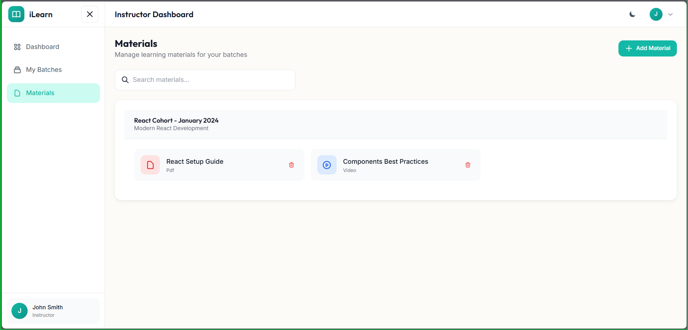

---

### 🎓 Learner Experience

  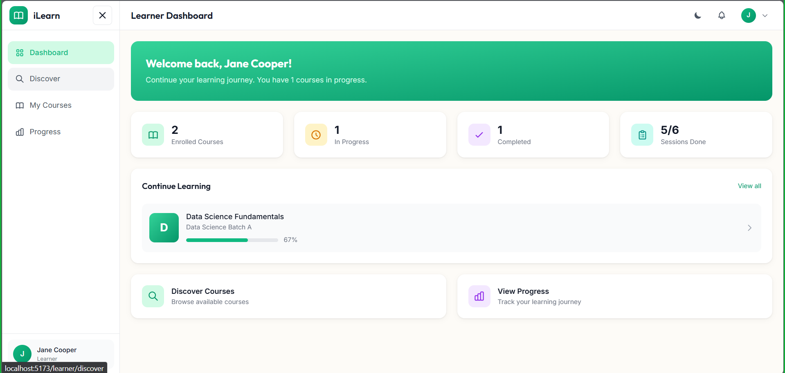
  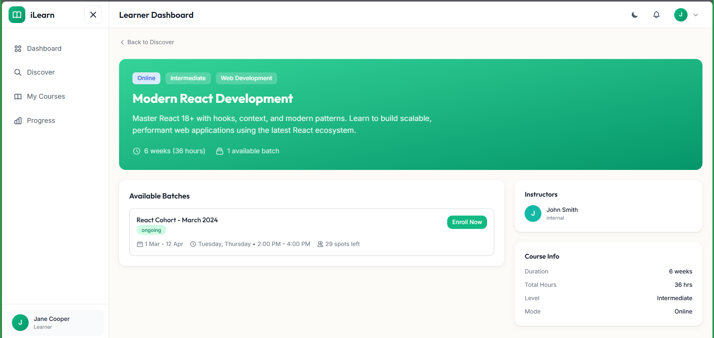
  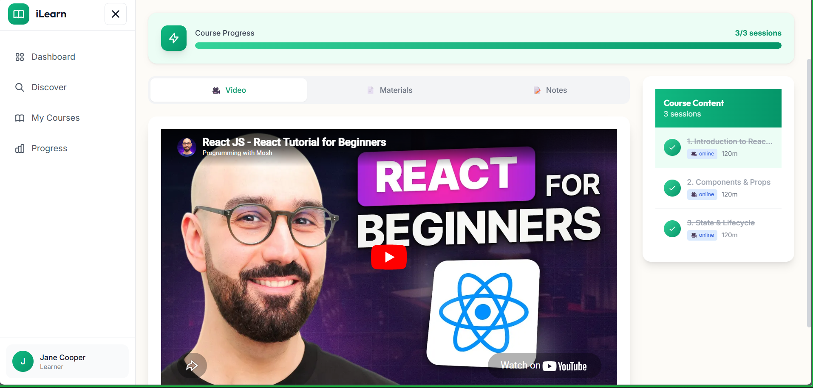

  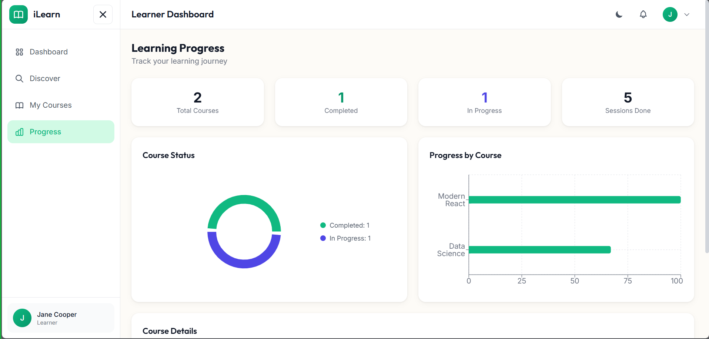

---

## 🤝 Contributors

- 👨‍💻 Abrar Ahmed  
  https://github.com/Czarabrar

- 👨‍💻 Mubeen Ahmed  
  https://github.com/Mubeen243

- 👨‍💻 Jeffer Piccaso  
  https://github.com/jefferpiccaso

---

## 🚧 Note

This project is a **hackathon prototype / LMS template** built to demonstrate rapid development using AI-assisted workflows.

---

## 📜 License

This project is licensed under **Ideassion Technology Solutions**